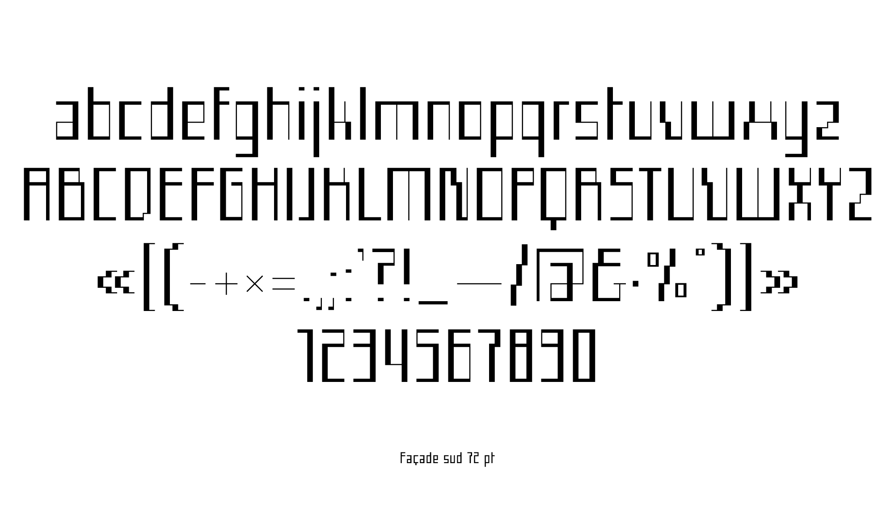

# Facade

### English

Facade is a typography created from the architectural grid of the ÉSAD Orléans facade. This grid is used as a basis for the first sketches, and then as the spirit for all the typeface. The regular version is more faithful to the architecture than the bold version which makes it more readable in small type sizes.

Facade is designed by Éléonore Fines, created for the visual identity of the ÉSAD Orléans 2020 open days by Antoine Buon, Laëtitia Cuchet, Hugo du Roure, Éléonore Fines, Mégane Lazou and Lucie Sahuquet.
You can use, modify and redistribute it freely. Free Facade from her walls!

*Credits :* ÉSAD Orléans, year 4, Graphic Design, 2020

*Thanks :* Nicolas Girard and Loïc Le Gall

### Français

Facade est une typographie créée à partir de la grille architecturale de la façade de l'ÉSAD Orléans. Cette grille sert de base aux dessins des premiers croquis, puis d'esprit pour l'ensemble des caractères. La version regular est davantage fidèle à l'architecture que la version bold qui la rend plus lisible en petit corps.

Facade est conçue par Éléonore Fines, créée pour l’identité visuelle des journées portes ouvertes de l’ÉSAD Orléans 2020 d'Antoine Buon, Laëtitia Cuchet, Hugo du Roure, Éléonore Fines, Mégane Lazou et Lucie Sahuquet.
Vous pouvez l’utiliser, la modifier et la redistribuer librement. Libérez Facade hors de ses murs !

*Crédits :* ÉSAD Orléans, 4e année, Design Visuel Graphique, 2020

*Remerciements :* Nicolas Girard et Loïc Le Gall

## Contact

[Website](https://eleonorefines.fr)
[Instagram](https://www.instagram.com/eleonore_fines/ "@eleonore_fines")

## License

Facade is licensed under the [SIL Open Font License](http://scripts.sil.org/OFL), version 1.1

