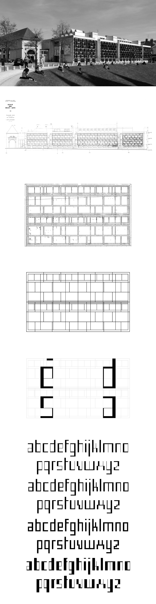

# Façade

### English

Façade is a typeface created from the architectural grid of the ÉSAD Orléans façade. This grid is used as a basis for the first sketches, then as a spirit for all the typefaces. Façade Sud (South) is faithful to the architecture while Façade Ouest (West), Est (East) and Sud-Ouest (South West) are emancipated from it.

Façade is designed by Éléonore Fines, initially created for the visual identity of the ÉSAD Orléans 2020 open days by Antoine Buon, Laëtitia Cuchet, Hugo du Roure, Éléonore Fines, Mégane Lazou and Lucie Sahuquet.

You can use, modify and redistribute it freely. Free Façade outside its walls!

[Façade, VTF](https://velvetyne.fr/fonts/facade/)

*Thanks: Nicolas Girard, Loïc Le Gall, the ÉSAD Orléans and the Velvetyne team*

### Français

Façade est une typographie créée à partir de la grille architecturale de la façade de l’ÉSAD Orléans. Cette grille sert de base aux dessins des premiers croquis, puis d’esprit pour l’ensemble des caractères. Façade Sud est fidèle à l’architecture tandis que Façade Ouest, Est et Sud-Ouest s’en émancipent.

Façade est conçue par Éléonore Fines, initialement créée pour l’identité visuelle des journées portes ouvertes de l’ÉSAD Orléans 2020 d’Antoine Buon, Laëtitia Cuchet, Hugo du Roure, Éléonore Fines, Mégane Lazou et Lucie Sahuquet.

Vous pouvez l’utiliser, la modifier et la redistribuer librement. Libérez Façade hors de ses murs !

[Façade, VTF](https://velvetyne.fr/fonts/facade/)

*Remerciements : Nicolas Girard, Loïc Le Gall, l’ÉSAD Orléans et l’équipe Velvetyne*

## Contact

[Website](https://eleonorefines.fr)

[Instagram](https://www.instagram.com/eleonore_fines/ "@eleonore_fines")

[Mail](mailto:eleonorefines@protonmail.com)

## License

Façade is licensed under the [SIL Open Font License](http://scripts.sil.org/OFL), version 1.1

